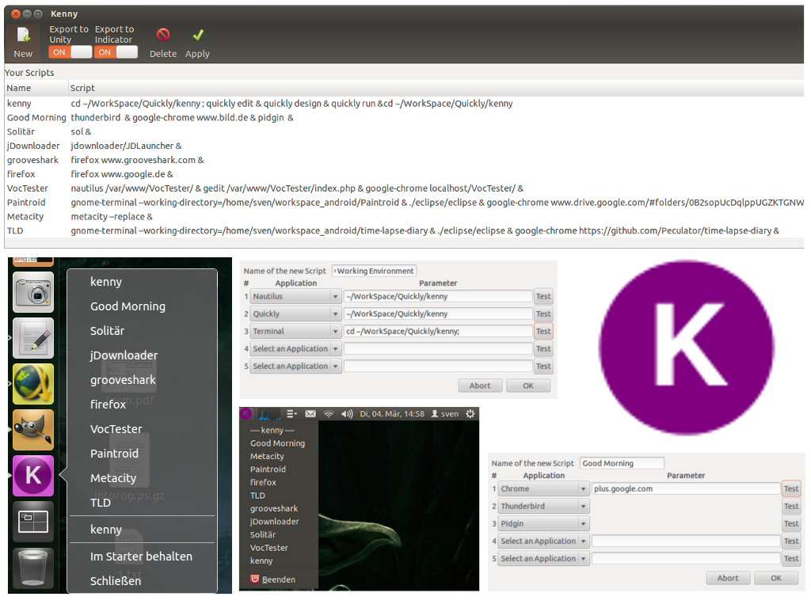

kenny is a light-weight editor to create application launcher scripts. It was written for the Ubuntu App Showdown 2013 and it's integrated in unity and in the indicator bar.

Kenny is an app to write start-up scripts, which can start a individuell Working Environment. If you're opening every morning the same applications or you need to open several applications to set up your working environment for develeopment then you do need kenny.
Features:
- Written with Quickly
- Unity Integration (Quicklaunch, Application Indicator, Notification) 
- Support for over 15 Applications and the possibility to create your own command 
- Open source

https://launchpad.net/kenny

Tutorial-Video von Jesús García Gómez: http://www.youtube.com/watch?v=K4Fu9MNidnA
